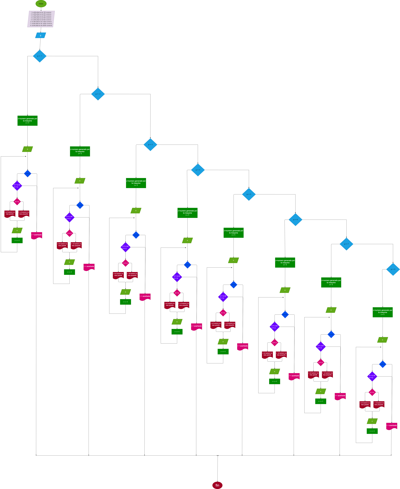

# adivina_numero

un juego para adivinar un numero y que el programa te de pistas y en cuantos intentos adivinaste
 
# analisis

## input

### variables
 
g = nivel de dificultad

 n = el numero que dijita el jugador

 z = numero generado por la maquina

 i = numero de intentos para acertar el numero

 r = respuesta de "ganaste o una pista"

 # processing

    if g == 1:

    p="facil"

    z = random.randint(1, 100)
    if n == z:
            r="ganaste el juego"
            print("===========================================================")
    else:
        while n < z or n> z:
            i = i + 1
            if n < z:
                r = "el numero es mas grande"
                print("===========================================================")
            else:
               r = "el numero es mas pequeño"
               print("===========================================================")
            print(r)
            print("===========================================================")
            n = int(input("dijite otra ves el numero: "))

    elif g == 2:

    p="normal"

    z = random.randint(1, 200)
    if n == z:
            r="ganaste el juego"
            print("===========================================================")
    else:
        while n < z or n> z:
            i = i + 1
            if n < z:
                r = "el numero es mas grande"
                print("===========================================================")
            else:
               r = "el numero es mas pequeño"
               print("===========================================================")
            print(r)
            n = int(input("dijite otra ves el numero: "))

    elif g == 3:

    p="medio"

    z = random.randint(1, 300)
    if n == z:
            r="ganaste el juego"
            print("===========================================================")
    else:
        while n < z or n> z:
            i = i + 1
            if n < z:
                r = "el numero es mas grande"
                print("===========================================================")
            else:
               r = "el numero es mas pequeño"
               print("===========================================================")
            print(r)
            n = int(input("dijite otra ves el numero: "))

    elif g == 4:

    p="dificil"

    z = random.randint(1, 400)
    
    if n == z:
            r="ganaste el juego"
    else:
        while n < z or n > z:
            i = i + 1
            
            if n < z:
                print("===========================================================")
                r = "el numero es mas grande"
            else:
                r = "el numero es mas pequeño"
                print("===========================================================")
            print(r)
            n = int(input("dijite otra ves el numero: "))
            print("===========================================================")

    elif g == 5:

    p="extremo"

    z = random.randint(1, 500)
    if n == z:
            r="ganaste el juego"
            print("===========================================================")
    else:
        while n < z or n> z:
            i = i + 1
            if n < z:
                r = "el numero es mas grande"
                print("===========================================================")
            else:
               r = "el numero es mas pequeño"
               print("===========================================================")
            print(r)
            n = int(input("dijite otra ves el numero: "))

    elif g == 6:

    p="imposible"

    z = random.randint(1, 1000)
    if n == z:
            r="ganaste el juego"
            print("===========================================================")
    else:
        while n < z or n> z:
            i = i + 1
            if n < z:
                r = "el numero es mas grande"
                print("===========================================================")
            else:
               r = "el numero es mas pequeño"
               print("===========================================================")
            print(r)
            n = int(input("dijite otra ves el numero: "))
            
    elif g == 7:

    p="legendario"

    z = random.randint(1, 10000)
    
    if n == z:
            r="ganaste el juego"
    else:
        while n < z or n > z:
            i = i + 1
            
            if n < z:
                print("===========================================================")
                r = "el numero es mas grande"
            else:
                r = "el numero es mas pequeño"
                print("===========================================================")
            print(r)
            n = int(input("dijite otra ves el numero: "))
            print("===========================================================")

    elif g == 8:

    p="extrema"

    z = random.randint(1, 20000)
    if n == z:
            r="ganaste el juego"
            print("===========================================================")
    else:
        while n < z or n> z:
            i = i + 1
            if n < z:
                r = "el numero es mas grande"
                print("===========================================================")
            else:
               r = "el numero es mas pequeño"
               print("===========================================================")
            print(r)
            n = int(input("dijite otra ves el numero: "))

else:
    p ="el numero  no es valido"

else:
    p ="el numero  no es valido"
 
 # diseño

 

 # construccion